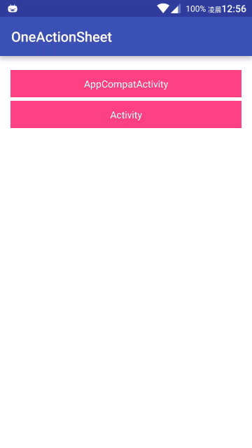

# One-ActionSheet

修改自 [ActionSheet](https://github.com/baoyongzhang/android-ActionSheet) 项目，自定义化的 `ActionSheet` 。

在项目使用过程中，一个项目一般只使用一个固定样式的 `ActionSheet` ，为了简化配置过程和解决按钮有阴影的问题，我这里进行一点修改：

- 默认为 `IOS7` 样式，无需额外配置
- 解决按钮点击时底部带阴影的问题（使用 TextView 代替 Button ）

## 项目介绍

名称是 `actionsheet` 的 `Module` 是我进行修改后的项目，原来的 `ActionSheet` 使用其官方介绍的方式进行引用：

```groovy
dependencies {
    compile 'com.baoyz.actionsheet:library:1.1.6'
}
```

**本项目使用方式**是把生成的 [aar](https://github.com/likfe/One-ActionSheet/raw/master/aar/custom-actionsheet.aar) 下载并拷贝到主项目的 `libs` 目录，并在配置引用：

1.配置项目根目录的 `/build.gradle` ：
```groovy
allprojects {
    repositories {
        ...
        flatDir {
            dirs 'libs'
        }
    }
}
```
2.在主 module 中引用 aar ，修改 `/app/build.gradle` 文件：

```groovy
dependencies {
    compile fileTree(include: ['*.jar'], dir: 'libs')
    compile(name: 'custom-actionsheet', ext: 'aar')
    ...
}
```
3.代码使用方法和原项目一致。

## 必要的说明 ##

如果你需要自己进行配色，建议使用原项目，仅仅配置主题文件即可。本项目如需修改配色等参数，需要修改代码。

## 对比与预览 ##




PS:

> 你可以通过 [Github](https://github.com/likfe)、[CSDN](http://blog.csdn.net/ys743276112) 和 [微博](http://weibo.com/zyansen) 联系我

